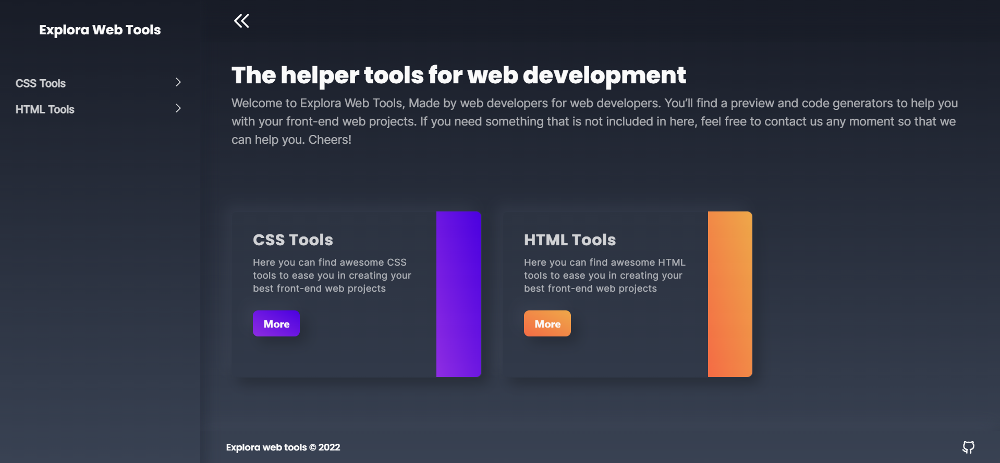

<div id="top"></div>

<!-- PROJECT LOGO -->
<br />
<div align="center">
  <a href="https://github.com/othneildrew/Best-README-Template">
    
  </a>

  <h3 align="center">Explora web tools</h3>

  <p align="center">
    The helper tools for web development
    <br />
    <a href="https://github.com/othneildrew/Best-README-Template">View Demo</a>
    ·
    <a href="https://github.com/ersankarimi/explora-web-tools/issues">Report Bug</a>
    ·
    <a href="https://github.com/ersankarimi/explora-web-tools/issues">Request Feature</a>
  </p>
</div>

<!-- TABLE OF CONTENTS -->
<details>
  <summary>Table of Contents</summary>
  <ol>
    <li>
      <a href="#about-the-project">About The Project</a>
      <ul>
        <li><a href="#built-with">Built With</a></li>
      </ul>
    </li>
    <li>
      <a href="#getting-started">Getting Started</a>
      <ul>
        <li><a href="#prerequisites">Prerequisites</a></li>
        <li><a href="#installation">Installation</a></li>
      </ul>
    </li>
    <li><a href="#contributing">Contributing</a></li>
    <li><a href="#license">License</a></li>
    <li><a href="#contact">Contact</a></li>
    <li><a href="#acknowledgments">Acknowledgments</a></li>
  </ol>
</details>

<!-- ABOUT THE PROJECT -->

## About The Project



There are many great tools like this available out there. Me and my friend just want to try to make a tool like that that can be used by me and many people.

Here's why:

-   Your time should be focused on creating something amazing. A project that solves a problem and helps others
-   Using tools, of course, will speed up our work.
-   With this tool will also make us write less code. Because we simply select the desired settings and retrieve the ready-made code instantly.

Sorry if not all the tools you are looking for are available on this website. So my friend and I will be adding more in no time. You can also suggest changes by forking this repo and making a pull request or opening an issue. Thanks to everyone who has used, and contributed to the expansion of this tool we created!

<p align="right">(<a href="#top">back to top</a>)</p>

### Built With

This section should list any major frameworks/libraries used to bootstrap your project. Leave any add-ons/plugins for the acknowledgements section. Here are a few examples.

-   [React.js](https://reactjs.org/)
-   [Tailwind.css](https://tailwindcss.com/)
-   [Framer Motion](https://framer.com/motion/)
-   [React Router v6](https://reactrouter.com/)
-   [Vite.js](https://vitejs.dev/)
<p align="right">(<a href="#top">back to top</a>)</p>

<!-- GETTING STARTED -->

## Getting Started

This is an example of how you may give instructions on setting up your project locally.
To get a local copy up and running follow these simple example steps.

### Prerequisites

Before installation, make sure you have installed the following tools :

-   [NodeJs](https://nodejs.org/en/download/)
-   [Git](https://git-scm.com/downloads)

### Installation

1. Fork this [repository](https://github.com/ersankarimi/birthday-reminder-informatika-2020)
2. Clone the repo
    ```bash
    git clone https://github.com/your_username_/Project-Name.git
    ```
3. Install NPM packages
    ```bash
    yarn
    # or `npm install`
    ```
4. Run the app in development mode. Go to http://localhost:3000 to view it in your browser. The page will reload when you make changes. You may also see a lint error in the console.

    ```bash
    yarn dev
    # or `npm run dev`
    ```

5. Build the app for production.
    ```bash
    yarn build
    # or `npm run build`
    ```

<p align="right">(<a href="#top">back to top</a>)</p>

<!-- CONTRIBUTING -->

## Contributing

Contributions are what make the open source community such an amazing place to learn, inspire, and create. Any contributions you make are **greatly appreciated**.

If you have a suggestion that would make this better, please fork the repo and create a pull request. You can also simply open an issue with the tag "enhancement".
Don't forget to give the project a star! Thanks again!

1. Fork the Project
2. Create your Feature Branch (`git checkout -b dev`)
3. Commit your Changes (`git commit -m 'Add some feature'`)
4. Push to the Branch (`git push origin dev`)
5. Open a Pull Request

<p align="right">(<a href="#top">back to top</a>)</p>

<!-- LICENSE -->

## License

Distributed under the MIT License. See `LICENSE.txt` for more information.

<p align="right">(<a href="#top">back to top</a>)</p>
